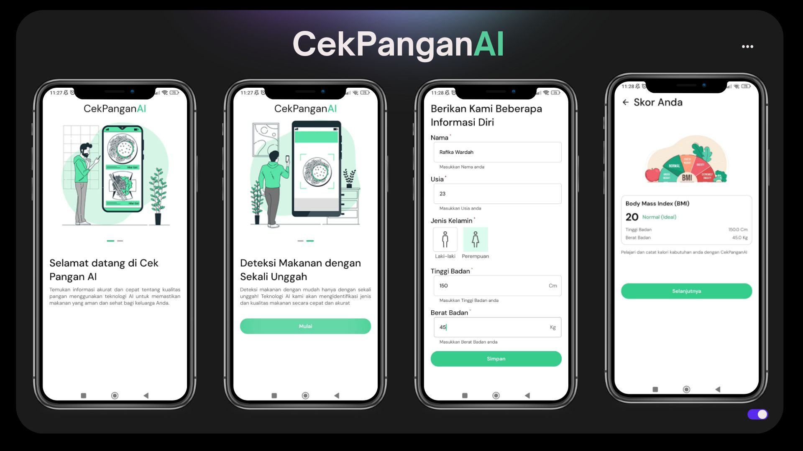
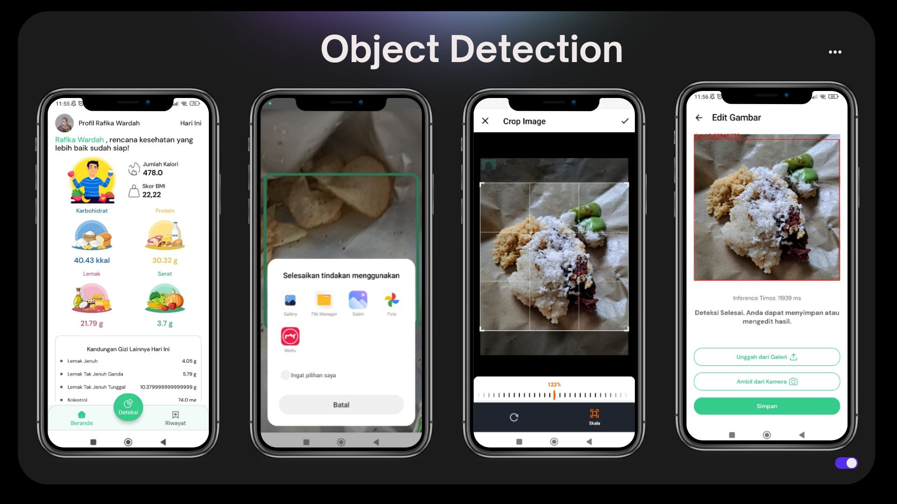
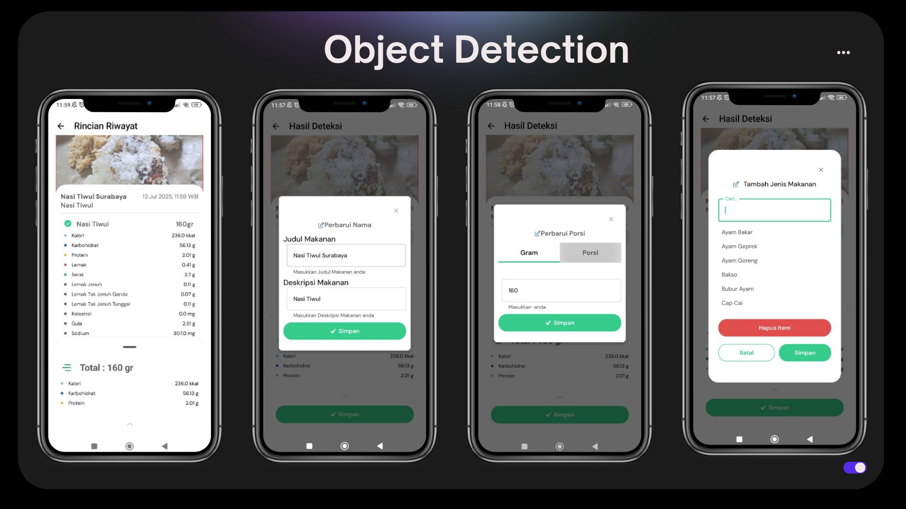
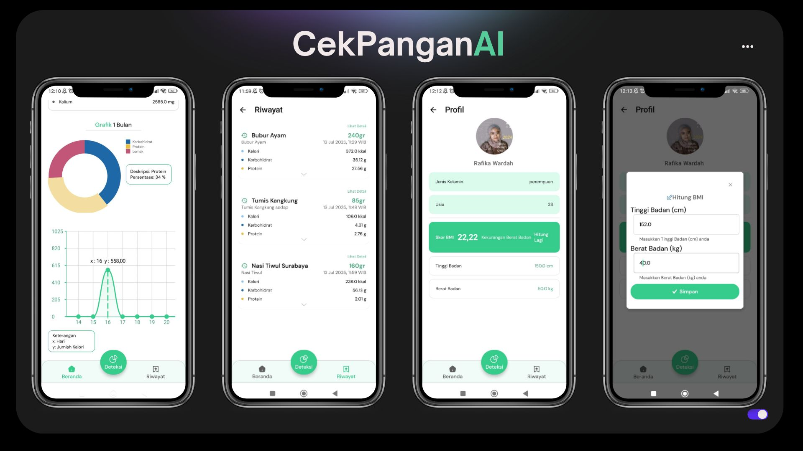

# CekPanganAI
 **CekPanganAI** is a food detection application designed to help control eating habits by calculating calories, macronutrients, and micronutrients in both grams and servings. The detection model is developed using YOLO11 with 39 food classes, utilizing 15,136 images and 20,191 annotations obtained through web scraping and the Roboflow platform. The application is built with a tech stack of **Jetpack Compose**, **XML**, and **TensorFlow Lite** to ensure optimal performance on mobile devices.

## Preview 

     
     
     
     

## Documentation 
* Design UI/UX : <a href="https://www.figma.com/design/TA624cpxZ1zyE8LJE5PWoD/CekPanganAI?node-id=1-3289&t=4gPxCeD8yJ5eBMQF-1" target="_blank">Figma CekPanganAI</a>
* Demo App : <a href="https://youtu.be/S1CrvC9wqts">CekPanganAI</a>

## Features 
- Provides a food detection feature by capturing photos directly or uploading images from the gallery.
- Requires an input image of food for the detection process.
- Displays nutritional information for the detected food, including calories, fat, carbohydrates, protein, fiber, saturated fat, polyunsaturated fat, monounsaturated fat, cholesterol, sugar, sodium, and potassium.
- Allows users to add, delete, and edit detected food items.
- Provides a portion editing feature, allowing adjustments in grams or servings according to user needs.
- Calculates the nutritional content, including calories, fat, carbohydrates, protein, fiber, saturated fat, polyunsaturated fat, monounsaturated fat, cholesterol, sugar, sodium, and potassium.
- Can save detection history for further monitoring purposes.
- Provides a BMI (Body Mass Index) calculation feature to monitor the user’s body weight.
- Can track total nutritional information for 1 day, 3 days, 1 week, and 1 month.
- Can display nutritional value graphs of protein, carbohydrates, and fiber in percentage, as well as daily calorie monitoring charts.
